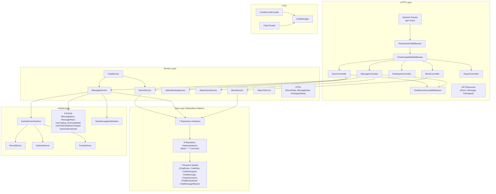
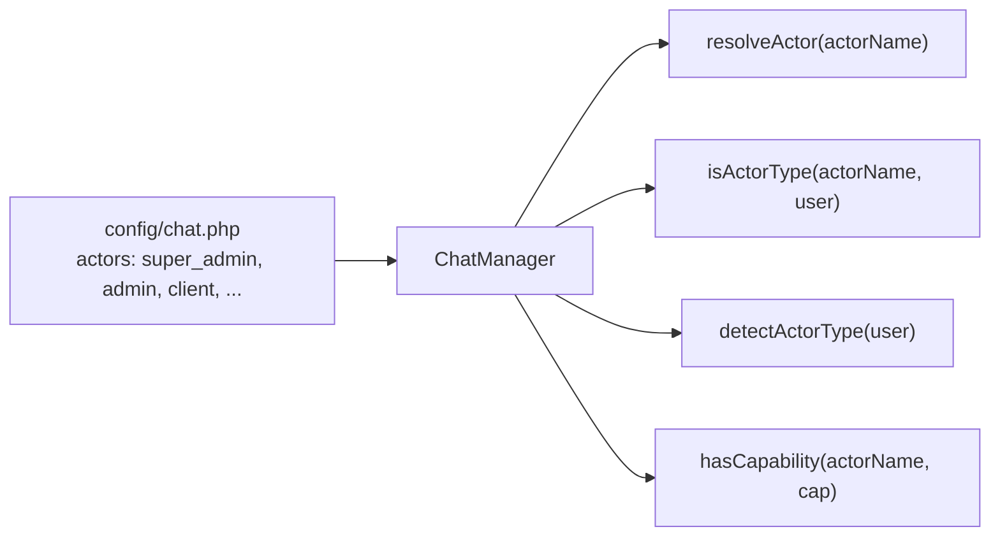
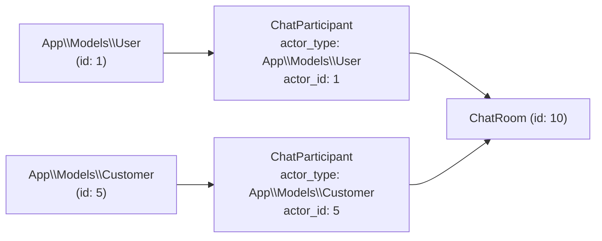
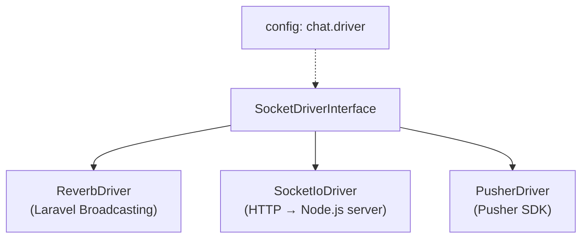
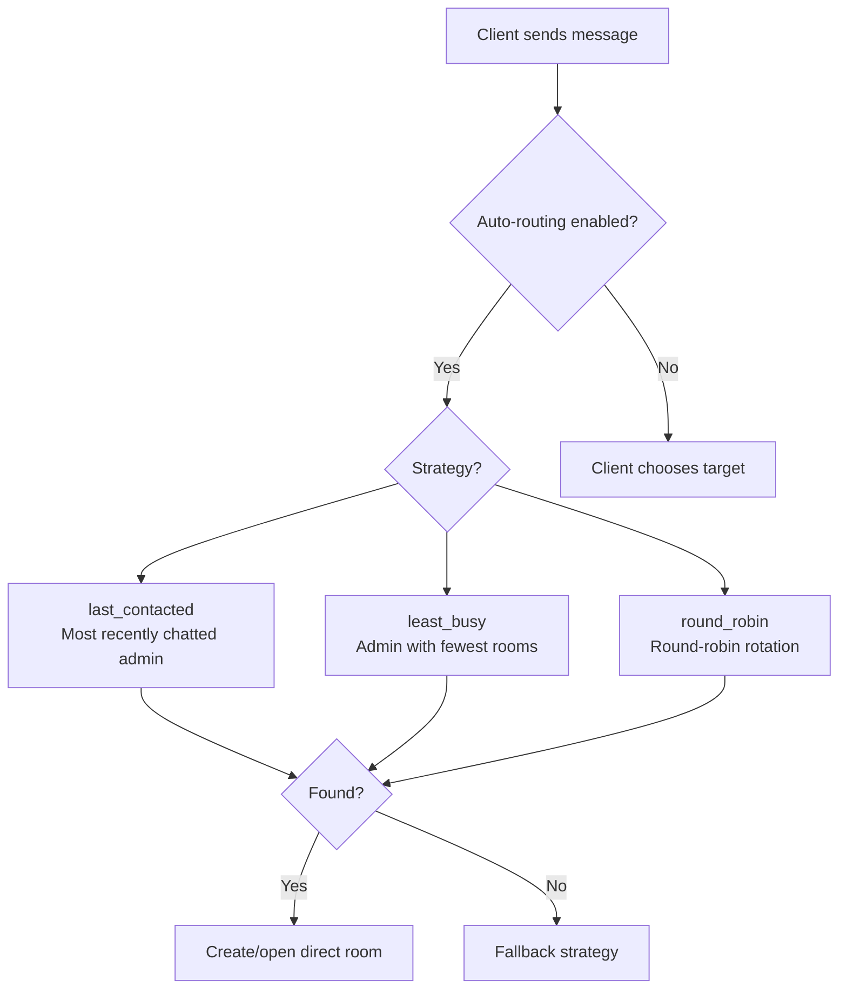

# Architecture — phucbui/laravel-chat

> Overall architecture of the chat package, including Actor System, Driver Strategy Pattern, Repository Pattern, Capability-based ACL, and Dynamic Routes.

## Architecture Overview



## Design Patterns

### 1. Actor System

Replaces hard-coded admin/client with a config-driven actors system:



- Each actor has: `model`, `guard`, `middleware`, `route_prefix`, `capabilities`
- Supports **multi-table auth** (each actor uses a different table) and **single-table + roles**
- Actor resolvers/matchers are registered at runtime via `Chat::resolveActorUsing()`, `Chat::matchActorUsing()`

### 2. Polymorphic Participants



- `chat_participants` uses morph columns (`actor_type` + `actor_id`)
- A single room can contain participants from multiple models/tables
- Same pattern applies to `sender_type/sender_id` in messages, `blocker/blocked` in blocks

### 3. Capability-Based Access Control

No hard-coded permissions; uses config-driven capabilities:

| Capability | Description |
|---|---|
| `can_initiate_chat` | Can start a new chat |
| `can_see_all_rooms` | View all rooms (super_admin) |
| `can_create_group` | Create group chats |
| `can_manage_participants` | Add/remove participants |
| `can_change_roles` | Change participant roles (super_admin only) |
| `can_receive_auto_routing` | Receive auto-routed client messages |
| `can_review_reports` | View and process reports |
| `can_block_users` | Block users |
| `can_search_messages` | Search messages |

### 4. Socket Driver Strategy



Driver is resolved in ServiceProvider based on `config('chat.driver')`.

### 5. Dynamic Routes

Routes are generated automatically for each actor:

```
config('chat.actors.super_admin.route_prefix') → api/super-admin/chat/*
config('chat.actors.admin.route_prefix')       → api/admin/chat/*
config('chat.actors.client.route_prefix')      → api/chat/*
```

Each actor set shares the same endpoints but with different middleware stacks (guard, resolve_actor).

### 6. Auto-Routing

When a client sends a message, the package automatically finds a suitable admin:



## Data Flow

```
Request → Middleware (Auth → ResolveActor → CheckCapability)
        → Controller (validate request)
        → Service (business logic)
        → Repository (data access)
        → Model (Eloquent ORM)
        → Database

Response ← Resource (format JSON)
         ← Controller
         ← Event (broadcast to socket)
         ← Notification (offline users)
```
