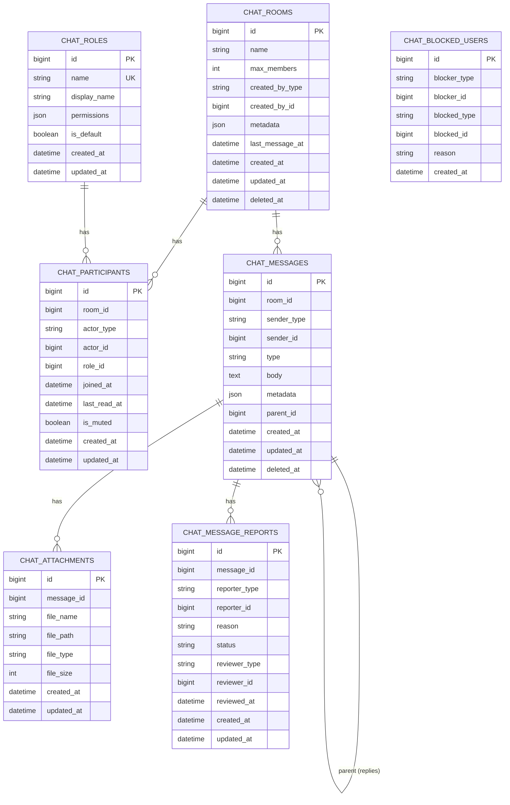

# Database Models — phucbui/laravel-chat

> Detailed documentation of 7 database tables, 7 Eloquent models, polymorphic relationships, and dynamic table names.

## Overview

- **No foreign key constraints** — compatible with any database setup
- **Uses `dateTime()`** instead of `timestamps()` — precise control
- **Table names are customizable** via `config('chat.table_names')`
- **Polymorphic morph** for actors (participants, senders, blockers)

## ER Diagram



## Model Details

### ChatRoom

| Column | Type | Cast | Description |
|---|---|---|---|
| `name` | `string` | — | Room name (null for direct rooms) |
| `max_members` | `integer` | `integer` | `2` = direct, `null` = unlimited |
| `created_by_type` | `string` | — | Creator morph class |
| `created_by_id` | `bigint` | — | Creator ID |
| `metadata` | `json` | `array` | Custom data |
| `last_message_at` | `datetime` | `datetime` | Time of last message |
| `deleted_at` | `datetime` | `datetime` | Soft delete |

**Relationships:**
- `creator()` → `morphTo('created_by')` — Room creator
- `participants()` → `hasMany(ChatParticipant)` — Members
- `messages()` → `hasMany(ChatMessage)` — Messages
- `latestMessage()` → `hasOne(ChatMessage)->latestOfMany()` — Latest message

**Accessors:**
- `is_direct` → `max_members === 2`
- `is_group` → `max_members !== 2`
- `getUnreadCountFor(Model $actor)` → Count of unread messages

**Indexes:** `[created_by_type, created_by_id]`, `last_message_at`

---

### ChatRole

| Column | Type | Cast | Description |
|---|---|---|---|
| `name` | `string` | — | Unique name (`owner`, `admin`, `member`) |
| `display_name` | `string` | — | Display name |
| `permissions` | `json` | `array` | In-room permission list |
| `is_default` | `boolean` | `boolean` | Default role for new members |

**Available permissions:** `send_message`, `delete_message`, `add_member`, `remove_member`, `manage_room`

---

### ChatParticipant

| Column | Type | Cast | Description |
|---|---|---|---|
| `room_id` | `bigint` | — | Room ID |
| `actor_type` | `string` | — | Morph class (polymorphic) |
| `actor_id` | `bigint` | — | Actor ID |
| `role_id` | `bigint` | — | Chat role within room |
| `joined_at` | `datetime` | `datetime` | Join time |
| `last_read_at` | `datetime` | `datetime` | Last read time (read receipt) |
| `is_muted` | `boolean` | `boolean` | Mute notifications |

**Relationships:**
- `actor()` → `morphTo('actor')` — User/Customer/Admin model
- `room()` → `belongsTo(ChatRoom)`
- `role()` → `belongsTo(ChatRole)`

**Unique constraint:** `[room_id, actor_type, actor_id]`

---

### ChatMessage

| Column | Type | Cast | Description |
|---|---|---|---|
| `room_id` | `bigint` | — | Room ID |
| `sender_type` | `string` | — | Sender morph class |
| `sender_id` | `bigint` | — | Sender ID |
| `type` | `string` | — | `text`, `image`, `file`, `system` |
| `body` | `text` | — | Message content |
| `metadata` | `json` | `array` | Additional data |
| `parent_id` | `bigint` | — | Parent message ID (replies) |
| `deleted_at` | `datetime` | `datetime` | Soft delete |

**Relationships:**
- `sender()` → `morphTo('sender')`
- `room()` → `belongsTo(ChatRoom)`
- `parent()` → `belongsTo(ChatMessage, 'parent_id')`
- `replies()` → `hasMany(ChatMessage, 'parent_id')`
- `attachments()` → `hasMany(ChatAttachment)`
- `reports()` → `hasMany(ChatMessageReport)`

---

### ChatAttachment

| Column | Type | Description |
|---|---|---|
| `message_id` | `bigint` | Message ID |
| `file_name` | `string` | Original file name |
| `file_path` | `string` | Storage path |
| `file_type` | `string` | MIME type |
| `file_size` | `integer` | Size in bytes |

**Accessor:** `file_size_human` → Human-readable format (e.g., "2.5 MB")

---

### ChatBlockedUser

| Column | Type | Description |
|---|---|---|
| `blocker_type/id` | morph | The blocker |
| `blocked_type/id` | morph | The blocked user |
| `reason` | `string` | Reason |
| `created_at` | `datetime` | Auto-set on creation |

**No `updated_at`** — `$timestamps = false`

---

### ChatMessageReport

| Column | Type | Description |
|---|---|---|
| `message_id` | `bigint` | Reported message |
| `reporter_type/id` | morph | Reporter |
| `reason` | `string` | Reason |
| `status` | `string` | `pending`, `reviewed`, `dismissed` |
| `reviewer_type/id` | morph | Reviewer (nullable) |
| `reviewed_at` | `datetime` | Review time |

## Migration Order

```
000001 → chat_rooms
000002 → chat_roles
000003 → chat_participants (depends on rooms + roles)
000004 → chat_messages (depends on rooms)
000005 → chat_attachments (depends on messages)
000006 → chat_blocked_users
000007 → chat_message_reports (depends on messages)
```
