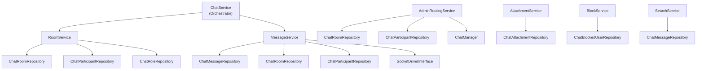

# Services — phucbui/laravel-chat

> Service Layer, Repository Pattern, DTOs, and core business logic documentation.

## Service Layer Overview



## Services

### 1. ChatService (Orchestrator)

Facade service combining `RoomService` and `MessageService`. Implements `ChatServiceInterface`.

| Method | Description |
|---|---|
| `findOrCreateDirectRoom(actorA, actorB)` | Find or create a 1v1 room |
| `createGroupRoom(RoomData, creator)` | Create a group room |
| `sendMessage(room, sender, MessageData)` | Send a message |
| `getMessages(room, perPage)` | Get room messages |
| `getRoomsForActor(actor, perPage)` | List rooms for an actor |
| `markAsRead(room, actor)` | Mark as read |

### 2. RoomService

| Method | Logic |
|---|---|
| `findOrCreateDirectRoom()` | Finds existing direct room (queries 2 participant morphs). If none → creates room + 2 participants (owner + member) |
| `createGroupRoom()` | Creates room, adds creator (owner), adds participants from `participantIds` |
| `addParticipant()` | Checks `max_members` limit, checks duplicates, creates participant, fires `RoomUpdated` event |
| `removeParticipant()` | Removes participant, fires `RoomUpdated` event |

**Important:**
- `findDirectRoom()` queries rooms with `max_members = 2` AND both actors are participants
- `addParticipant()` checks `countInRoom()` vs `max_members` before adding

### 3. MessageService

| Method | Logic |
|---|---|
| `send()` | Create message → touch `last_message_at` → broadcast via driver → fire `MessageSent` event → notify offline participants (if enabled) |
| `markAsRead()` | Update `last_read_at` → fire `MessageRead` event |
| `search()` | Delegates to `ChatMessageRepository.search()` |

**Notification flow (3 modes):**
1. Built-in: uses `NewMessageNotification`
2. Custom class: config `notifications.notification_class`
3. Event-only: `notifications.enabled = false`, host listens to `MessageSent`

### 4. AdminRoutingService

**3 auto-routing strategies:**

| Strategy | How it works |
|---|---|
| `last_contacted` | Finds admin who last chatted with client (by room `last_message_at`) |
| `least_busy` | Finds admin with fewest rooms (COUNT participants) |
| `round_robin` | Finds admin assigned a room longest ago (MAX room `created_at`) |

**Fallback:** If primary strategy fails → uses fallback strategy.

### 5. AttachmentService

| Method | Logic |
|---|---|
| `upload()` | Validate → store file to disk → create `ChatAttachment` record |
| `delete()` | Delete file from storage → delete DB record |
| `validateFile()` | Check `max_size` (KB) + `allowed_types` (MIME pattern matching) |

### 6. BlockService

| Method | Logic |
|---|---|
| `block()` | Check duplicate → create block record |
| `unblock()` | Find block → delete |
| `isBlockedBidirectional()` | Check both directions (A blocks B OR B blocks A) |

### 7. SearchService

Wrapper for `ChatMessageRepository.search()` with `chat.messages.search_enabled` check.

---

## Repository Pattern

### Structure

```
Contracts/Repositories/
├── ChatRoomRepositoryInterface
├── ChatMessageRepositoryInterface
├── ChatParticipantRepositoryInterface
├── ChatRoleRepositoryInterface
├── ChatAttachmentRepositoryInterface
├── ChatBlockedUserRepositoryInterface
└── ChatReportRepositoryInterface

Repositories/
├── BaseRepository (abstract)
├── ChatRoomRepository
├── ChatMessageRepository
├── ChatParticipantRepository
├── ChatRoleRepository
├── ChatAttachmentRepository
├── ChatBlockedUserRepository
└── ChatReportRepository
```

### BaseRepository

Provides common methods: `find()`, `findOrFail()`, `all()`, `create()`, `update()`, `delete()`, `paginate()`.

### Binding (ServiceProvider)

```php
$this->app->bind(ChatRoomRepositoryInterface::class, ChatRoomRepository::class);
// ... 6 more bindings
```

Host project can override by binding a different implementation.

---

## DTOs

### RoomData
| Property | Type | Description |
|---|---|---|
| `name` | `?string` | Room name |
| `maxMembers` | `?int` | Member limit |
| `metadata` | `?array` | Custom metadata |
| `participantIds` | `array` | Participant ID list |
| `participantType` | `?string` | Participant model class |

### MessageData
| Property | Type | Description |
|---|---|---|
| `type` | `string` | `text`, `image`, `file`, `system` |
| `body` | `?string` | Content |
| `metadata` | `?array` | Metadata |
| `parentId` | `?int` | Reply to message ID |

### ParticipantData
| Property | Type | Description |
|---|---|---|
| `actorType` | `string` | Morph class |
| `actorId` | `int` | Actor ID |
| `roleName` | `?string` | Role name (default: `member`) |
