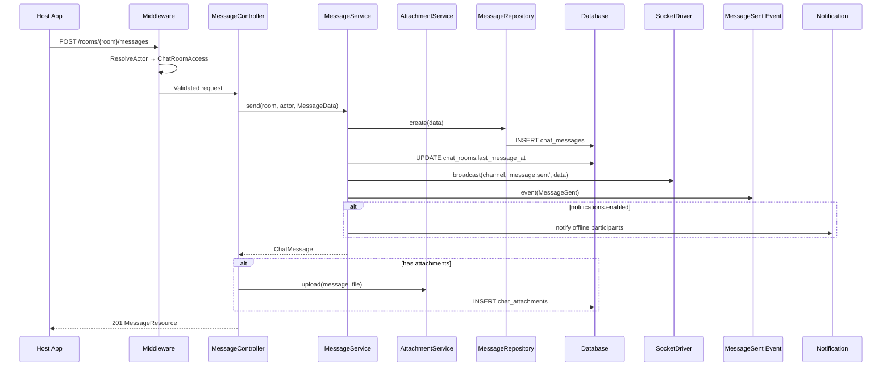

# API Endpoints — phucbui/laravel-chat

> Tài liệu tham chiếu đầy đủ cho tất cả API endpoints. Routes được sinh động cho mỗi actor type, prefix phụ thuộc vào config.

## Route Registration

Routes được `ChatServiceProvider` sinh tự động dựa trên `config('chat.actors')`. Ví dụ mặc định:

| Actor | Prefix | Middleware Stack |
|---|---|---|
| `super_admin` | `api/super-admin/chat` | `auth:sanctum`, `chat.resolve_actor:super_admin` |
| `admin` | `api/admin/chat` | `auth:sanctum`, `chat.resolve_actor:admin` |
| `client` | `api/chat` | `auth:sanctum`, `chat.resolve_actor:client` |

## Middleware

| Alias | Class | Mô tả |
|---|---|---|
| `chat.resolve_actor` | `ResolveActorMiddleware` | Resolve user hiện tại thành actor, gắn `chat_actor` + `chat_actor_name` vào request |
| `chat.capability` | `CheckCapabilityMiddleware` | Kiểm tra actor có capability cụ thể |
| `chat.room_access` | `ChatRoomAccessMiddleware` | Kiểm tra actor có quyền truy cập room (member hoặc `can_see_all_rooms`) |

---

## Rooms

### GET `/{prefix}/rooms` — Danh sách rooms

**Capability**: Nếu `can_see_all_rooms` → trả tất cả rooms. Ngược lại → chỉ rooms mà actor tham gia.

**Query Parameters:**
| Param | Type | Default | Mô tả |
|---|---|---|---|
| `per_page` | integer | 20 | Số rooms mỗi trang |

**Response** `200`:
```json
{
  "data": [
    {
      "id": 1,
      "name": "Support Room",
      "max_members": null,
      "is_direct": false,
      "is_group": true,
      "metadata": null,
      "last_message_at": "2024-01-15T10:30:00.000000Z",
      "created_at": "2024-01-10T08:00:00.000000Z",
      "participants": [
        {
          "id": 1,
          "actor_type": "App\\Models\\User",
          "actor_id": 3,
          "role": {"id": 1, "name": "owner", "display_name": "Owner"},
          "joined_at": "2024-01-10T08:00:00.000000Z",
          "last_read_at": "2024-01-15T10:30:00.000000Z",
          "is_muted": false,
          "actor": {"id": 3, "type": "App\\Models\\User", "name": "Phuc Bui", "avatar": null}
        }
      ],
      "latest_message": {
        "id": 42,
        "room_id": 1,
        "sender_type": "App\\Models\\User",
        "sender_id": 3,
        "type": "text",
        "body": "Hello!",
        "metadata": null,
        "parent_id": null,
        "is_reply": false,
        "created_at": "2024-01-15T10:30:00.000000Z",
        "sender": {
          "id": 3,
          "type": "App\\Models\\User",
          "name": "Phuc Bui",
          "avatar": "https://..."
        },
        "attachments": [],
        "parent": null
      },
      "unread_count": 3
    }
  ],
  "links": {
    "first": "http://localhost/api/chat/rooms?page=1",
    "last": "http://localhost/api/chat/rooms?page=1",
    "prev": null,
    "next": null
  },
  "meta": {
    "current_page": 1,
    "from": 1,
    "last_page": 1,
    "path": "http://localhost/api/chat/rooms",
    "per_page": 20,
    "to": 1,
    "total": 1
  }
}
```

### POST `/{prefix}/rooms` — Tạo room

**Direct room** (1v1):
```json
{
  "target_id": 5,
  "target_type": "App\\Models\\User"
}
```

**Group room** (yêu cầu capability `can_create_group`):
```json
{
  "name": "Team Chat",
  "max_members": 20,
  "participant_ids": [2, 3, 5],
  "participant_type": "App\\Models\\User",
  "metadata": {"department": "sales"}
}
```

**Validation:**
| Field | Rules |
|---|---|
| `target_id` | `required_without:name`, `integer` |
| `target_type` | `required_with:target_id`, `string` |
| `name` | `required_without:target_id`, `string`, `max:255` |
| `max_members` | `nullable`, `integer`, `min:2` |
| `participant_ids` | `nullable`, `array` |
| `participant_type` | `required_with:participant_ids`, `string` |

**Auto-routing**: Khi `from_actor` (client) tạo direct room và auto-routing enabled, package tự động tìm admin phù hợp thay vì dùng `target_id`.

**Response** `201`: `RoomResource`

### PUT `/{prefix}/rooms/{room}` — Cập nhật room

**Middleware**: `chat.room_access`
**Capability**: `can_manage_participants`

```json
{
  "name": "New Room Name",
  "metadata": {"pinned": true}
}
```

**Response** `200`: `RoomResource`

### DELETE `/{prefix}/rooms/{room}` — Xóa room (soft delete)

**Middleware**: `chat.room_access`
**Capability**: `can_manage_participants`

**Response** `200`:
```json
{"message": "Room deleted."}
```

---

## Messages

### GET `/{prefix}/rooms/{room}/messages` — Lấy tin nhắn

**Middleware**: `chat.room_access`

**Query Parameters:**
| Param | Type | Default | Mô tả |
|---|---|---|---|
| `per_page` | integer | 50 (`chat.messages.per_page`) | Số messages mỗi trang |

**Response** `200`: Paginated `MessageResource` (newest first)

```json
{
  "data": [
    {
      "id": 42,
      "room_id": 1,
      "sender_type": "App\\Models\\User",
      "sender_id": 3,
      "type": "text",
      "body": "Hello!",
      "metadata": null,
      "parent_id": null,
      "is_reply": false,
      "created_at": "2024-01-15T10:30:00.000000Z",
      "sender": {
        "id": 3,
        "type": "App\\Models\\User",
        "name": "Phuc Bui",
        "avatar": "https://..."
      },
      "attachments": [],
      "parent": null
    }
  ]
}
```

### POST `/{prefix}/rooms/{room}/messages` — Gửi tin nhắn

**Middleware**: `chat.room_access`

```json
{
  "body": "Hello, how can I help you?",
  "type": "text",
  "parent_id": null,
  "metadata": {"priority": "high"}
}
```

**Hỗ trợ file attachments** (multipart/form-data):
| Field | Rules |
|---|---|
| `body` | `required_without:attachments`, `string`, `max:5000` |
| `type` | `sometimes`, `in:text,image,file,system` |
| `parent_id` | `sometimes`, `integer` |
| `metadata` | `sometimes`, `array` |
| `attachments` | `sometimes`, `array` |
| `attachments.*` | `file` |

**Processing flow:**



**Response** `201`: `MessageResource`

### POST `/{prefix}/rooms/{room}/read` — Đánh dấu đã đọc

**Middleware**: `chat.room_access`

**Response** `200`:
```json
{"message": "Marked as read."}
```

Fires `MessageRead` event → broadcast read receipt.

### POST `/{prefix}/rooms/{room}/typing` — Typing indicator

**Middleware**: `chat.room_access`

```json
{"is_typing": true}
```

Fires `UserTyping` event → broadcast to room.

### GET `/{prefix}/messages/search` — Tìm kiếm tin nhắn

| Param | Type | Rules | Mô tả |
|---|---|---|---|
| `keyword` | string | `required`, `min:2` | Từ khóa tìm kiếm |
| `room_id` | integer | `sometimes` | Lọc theo room |
| `from_date` | date | `sometimes` | Từ ngày |
| `to_date` | date | `sometimes` | Đến ngày |

**Response** `200`: Paginated `MessageResource`

---

## Participants

### GET `/{prefix}/rooms/{room}/participants` — Danh sách participants

**Middleware**: `chat.room_access`

**Response** `200`:
```json
{
  "data": [
    {
      "id": 1,
      "actor_type": "App\\Models\\User",
      "actor_id": 3,
      "role": {"id": 1, "name": "owner", "display_name": "Owner"},
      "joined_at": "2024-01-10T08:00:00.000000Z",
      "last_read_at": "2024-01-15T10:30:00.000000Z",
      "is_muted": false,
      "actor": {"id": 3, "type": "App\\Models\\User", "name": "Phuc Bui", "avatar": null}
    }
  ]
}
```

### POST `/{prefix}/rooms/{room}/participants` — Thêm participant

**Middleware**: `chat.room_access`
**Capability**: `can_manage_participants`

```json
{
  "actor_id": 5,
  "actor_type": "App\\Models\\User",
  "role_name": "member"
}
```

**Response** `201`

### PUT `/{prefix}/rooms/{room}/participants/{participant}` — Đổi role

**Middleware**: `chat.room_access`
**Capability**: `can_change_roles` (chỉ super_admin)

```json
{"role_name": "admin"}
```

**Response** `200`: `ParticipantResource`

### DELETE `/{prefix}/rooms/{room}/participants/{participant}` — Xóa participant

**Middleware**: `chat.room_access`
**Capability**: `can_manage_participants`

**Response** `200`

---

## Block Users

### GET `/{prefix}/blocked-users` — Danh sách blocked

### POST `/{prefix}/users/{user}/block` — Block user
**Capability**: `can_block_users`

```json
{
  "target_type": "App\\Models\\User",
  "reason": "Spam messages"
}
```

### DELETE `/{prefix}/users/{user}/block` — Unblock user

```json
{"target_type": "App\\Models\\User"}
```

---

## Reports

### POST `/{prefix}/messages/{message}/report` — Báo cáo tin nhắn

```json
{"reason": "Inappropriate content"}
```

### GET `/{prefix}/reports` — Danh sách reports
**Capability**: `can_review_reports`

| Param | Values | Default |
|---|---|---|
| `status` | `pending`, `all` | `pending` |

### PUT `/{prefix}/reports/{report}` — Review report
**Capability**: `can_review_reports`

```json
{"status": "reviewed"}
```
