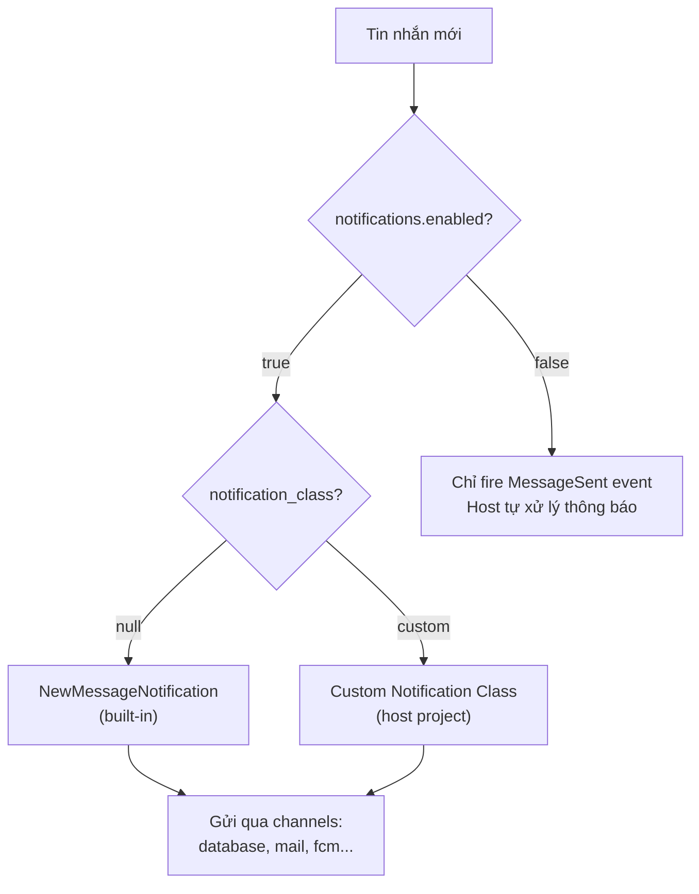

# Events & Notifications — phucbui/laravel-chat

> Tài liệu về 6 broadcast events, notification system, và channel naming conventions.

## Events Overview

Tất cả events **LUÔN được fire** bất kể config notification. Host project có thể lắng nghe events này trong `EventServiceProvider`.

| Event | Channel | Broadcast As | Khi nào fire |
|---|---|---|---|
| `MessageSent` | `private: chat.room.{id}` | `message.sent` | Gửi tin nhắn mới |
| `MessageRead` | `private: chat.room.{id}` | `message.read` | Đánh dấu đã đọc |
| `UserTyping` | `private: chat.room.{id}` | `user.typing` | Typing indicator |
| `RoomUpdated` | `private: chat.room.{id}` | `room.updated` | Thay đổi room/participants |
| `UserOnlineStatusChanged` | `public: chat.online` | `user.online_status` | Thay đổi trạng thái online |
| `GenericBroadcast` | Dynamic | Dynamic | Used internally by ReverbDriver |

## Chi tiết Events

### MessageSent

```json
{
  "message": {
    "id": 42,
    "room_id": 1,
    "sender_type": "App\\Models\\User",
    "sender_id": 3,
    "type": "text",
    "body": "Hello!",
    "metadata": null,
    "parent_id": null,
    "created_at": "2024-01-15T10:30:00.000000Z"
  }
}
```

**Properties:** `ChatMessage $message`, `ChatRoom $room`

### MessageRead

```json
{
  "room_id": 1,
  "actor_type": "App\\Models\\User",
  "actor_id": 3,
  "read_at": "2024-01-15T10:31:00.000000Z"
}
```

### UserTyping

```json
{
  "room_id": 1,
  "actor_type": "App\\Models\\User",
  "actor_id": 3,
  "is_typing": true
}
```

### RoomUpdated

```json
{
  "room_id": 1,
  "action": "participant_added",
  "name": "Team Chat",
  "max_members": 20
}
```

**Action values:** `updated`, `participant_added`, `participant_removed`

### UserOnlineStatusChanged

```json
{
  "actor_type": "App\\Models\\User",
  "actor_id": 3,
  "is_online": true
}
```

**Channel:** Public `chat.online` (không require auth)

---

## Notification System

### 3 chế độ



### Config

```php
'notifications' => [
    'enabled' => true,                    // false = event-only mode
    'channels' => ['database'],           // database | mail | fcm
    'notify_offline_only' => true,
    'notification_class' => null,         // null = built-in, hoặc class tùy chỉnh
],
```

### Built-in NewMessageNotification

**Payload (toArray):**
```json
{
  "type": "chat_message",
  "room_id": 1,
  "room_name": "Support Room",
  "message_id": 42,
  "message_body": "Hello!",
  "message_type": "text",
  "sender_type": "App\\Models\\User",
  "sender_id": 3
}
```

### Custom Notification Class

Class phải nhận `(ChatMessage $message, ChatRoom $room)` trong constructor:

```php
// App\Notifications\ChatNotification
class ChatNotification extends Notification
{
    public function __construct(
        public ChatMessage $message,
        public ChatRoom $room,
    ) {}

    public function via($notifiable): array
    {
        return ['database', 'fcm']; // channels tùy chỉnh
    }
}
```

Config:
```php
'notification_class' => \App\Notifications\ChatNotification::class,
```

### Event-Only Mode (Host tự xử lý)

```php
// Host AppServiceProvider hoặc EventServiceProvider:
Event::listen(MessageSent::class, function (MessageSent $event) {
    // Gửi thông báo bằng hệ thống riêng
    $message = $event->message;
    $room = $event->room;
    // ... custom notification logic
});
```

## Channel Naming Convention

| Driver | Private Channel | Presence Channel |
|---|---|---|
| Reverb | `chat.room.{id}` | `presence-chat.room.{id}` |
| Socket.IO | `chat_room_{id}` | `presence_chat_room_{id}` |
| Pusher | `private-chat.room.{id}` | `presence-chat.room.{id}` |

Public channel: `chat.online` (tất cả drivers)
