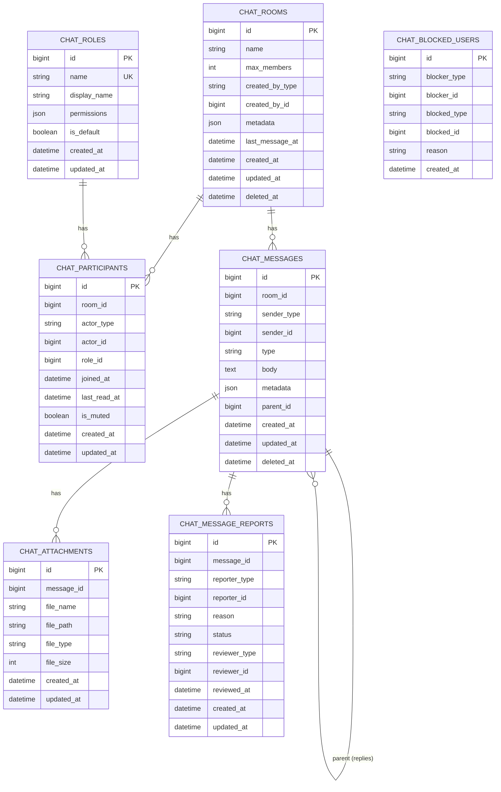

# Database Models — phucbui/laravel-chat

> Tài liệu chi tiết về 7 database tables, 7 Eloquent models, polymorphic relationships, và dynamic table names.

## Tổng quan

- **Không sử dụng foreign key constraints** — tương thích với mọi database setup
- **Sử dụng `dateTime()`** thay vì `timestamps()` — kiểm soát chính xác
- **Table names customizable** qua `config('chat.table_names')`
- **Polymorphic morph** cho actors (participants, senders, blockers)

## ER Diagram



## Chi tiết Models

### ChatRoom

| Cột | Type | Cast | Mô tả |
|---|---|---|---|
| `name` | `string` | — | Tên room (null cho direct room) |
| `max_members` | `integer` | `integer` | `2` = direct, `null` = unlimited |
| `created_by_type` | `string` | — | Morph class của creator |
| `created_by_id` | `bigint` | — | ID của creator |
| `metadata` | `json` | `array` | Dữ liệu tùy chỉnh |
| `last_message_at` | `datetime` | `datetime` | Thời điểm tin nhắn cuối cùng |
| `deleted_at` | `datetime` | `datetime` | Soft delete |

**Relationships:**
- `creator()` → `morphTo('created_by')` — Người tạo room
- `participants()` → `hasMany(ChatParticipant)` — Các thành viên
- `messages()` → `hasMany(ChatMessage)` — Tin nhắn
- `latestMessage()` → `hasOne(ChatMessage)->latestOfMany()` — Tin nhắn mới nhất

**Accessors:**
- `is_direct` → `max_members === 2`
- `is_group` → `max_members !== 2`
- `getUnreadCountFor(Model $actor)` → Đếm tin nhắn chưa đọc

**Indexes:** `[created_by_type, created_by_id]`, `last_message_at`

---

### ChatRole

| Cột | Type | Cast | Mô tả |
|---|---|---|---|
| `name` | `string` | — | Unique name (`owner`, `admin`, `member`) |
| `display_name` | `string` | — | Tên hiển thị |
| `permissions` | `json` | `array` | Danh sách permissions trong room |
| `is_default` | `boolean` | `boolean` | Role mặc định cho member mới |

**Permissions có sẵn:** `send_message`, `delete_message`, `add_member`, `remove_member`, `manage_room`

---

### ChatParticipant

| Cột | Type | Cast | Mô tả |
|---|---|---|---|
| `room_id` | `bigint` | — | Room ID |
| `actor_type` | `string` | — | Morph class (polymorphic) |
| `actor_id` | `bigint` | — | Actor ID |
| `role_id` | `bigint` | — | Chat role trong room |
| `joined_at` | `datetime` | `datetime` | Thời điểm tham gia |
| `last_read_at` | `datetime` | `datetime` | Thời điểm đọc cuối (read receipt) |
| `is_muted` | `boolean` | `boolean` | Tắt thông báo |

**Relationships:**
- `actor()` → `morphTo('actor')` — User/Customer/Admin model
- `room()` → `belongsTo(ChatRoom)`
- `role()` → `belongsTo(ChatRole)`

**Unique constraint:** `[room_id, actor_type, actor_id]`

---

### ChatMessage

| Cột | Type | Cast | Mô tả |
|---|---|---|---|
| `room_id` | `bigint` | — | Room ID |
| `sender_type` | `string` | — | Morph class người gửi |
| `sender_id` | `bigint` | — | ID người gửi |
| `type` | `string` | — | `text`, `image`, `file`, `system` |
| `body` | `text` | — | Nội dung tin nhắn |
| `metadata` | `json` | `array` | Dữ liệu bổ sung |
| `parent_id` | `bigint` | — | ID tin nhắn cha (reply) |
| `deleted_at` | `datetime` | `datetime` | Soft delete |

**Relationships:**
- `sender()` → `morphTo('sender')`
- `room()` → `belongsTo(ChatRoom)`
- `parent()` → `belongsTo(ChatMessage, 'parent_id')`
- `replies()` → `hasMany(ChatMessage, 'parent_id')`
- `attachments()` → `hasMany(ChatAttachment)`
- `reports()` → `hasMany(ChatMessageReport)`

---

### ChatAttachment

| Cột | Type | Mô tả |
|---|---|---|
| `message_id` | `bigint` | Message ID |
| `file_name` | `string` | Tên file gốc |
| `file_path` | `string` | Đường dẫn storage |
| `file_type` | `string` | MIME type |
| `file_size` | `integer` | Kích thước (bytes) |

**Accessor:** `file_size_human` → Format dễ đọc (e.g., "2.5 MB")

---

### ChatBlockedUser

| Cột | Type | Mô tả |
|---|---|---|
| `blocker_type/id` | morph | Người block |
| `blocked_type/id` | morph | Người bị block |
| `reason` | `string` | Lý do |
| `created_at` | `datetime` | Auto-set khi creating |

**Không có `updated_at`** — `$timestamps = false`

---

### ChatMessageReport

| Cột | Type | Mô tả |
|---|---|---|
| `message_id` | `bigint` | Tin nhắn bị report |
| `reporter_type/id` | morph | Người report |
| `reason` | `string` | Lý do |
| `status` | `string` | `pending`, `reviewed`, `dismissed` |
| `reviewer_type/id` | morph | Người xử lý (nullable) |
| `reviewed_at` | `datetime` | Thời điểm xử lý |

## Migration Order

```
000001 → chat_rooms
000002 → chat_roles
000003 → chat_participants (depends on rooms + roles)
000004 → chat_messages (depends on rooms)
000005 → chat_attachments (depends on messages)
000006 → chat_blocked_users
000007 → chat_message_reports (depends on messages)
```
