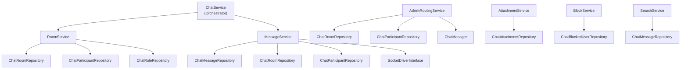

# Services — phucbui/laravel-chat

> Tài liệu Service Layer, Repository Pattern, DTOs, và logic nghiệp vụ chính.

## Service Layer Overview



## Services

### 1. ChatService (Orchestrator)

Facade service tổng hợp `RoomService` và `MessageService`. Implement `ChatServiceInterface`.

| Method | Mô tả |
|---|---|
| `findOrCreateDirectRoom(actorA, actorB)` | Tìm hoặc tạo room 1v1 |
| `createGroupRoom(RoomData, creator)` | Tạo group room |
| `sendMessage(room, sender, MessageData)` | Gửi tin nhắn |
| `getMessages(room, perPage)` | Lấy tin nhắn room |
| `getRoomsForActor(actor, perPage)` | Danh sách rooms |
| `markAsRead(room, actor)` | Đánh dấu đã đọc |

### 2. RoomService

| Method | Logic |
|---|---|
| `findOrCreateDirectRoom()` | Tìm existing direct room (query 2 participants morph). Nếu không có → tạo room + 2 participants (owner + member) |
| `createGroupRoom()` | Tạo room, add creator (owner), add participants từ `participantIds` |
| `addParticipant()` | Check `max_members` limit, check duplicate, tạo participant, fire `RoomUpdated` event |
| `removeParticipant()` | Xóa participant, fire `RoomUpdated` event |

**Quan trọng:**
- `findDirectRoom()` query rooms có `max_members = 2` VÀ cả 2 actors đều là participants
- `addParticipant()` check `countInRoom()` vs `max_members` trước khi thêm

### 3. MessageService

| Method | Logic |
|---|---|
| `send()` | Create message → touch `last_message_at` → broadcast qua driver → fire `MessageSent` event → notify offline participants (nếu enabled) |
| `markAsRead()` | Update `last_read_at` → fire `MessageRead` event |
| `search()` | Delegate để `ChatMessageRepository.search()` |

**Notification flow (3 modes):**
1. Built-in: dùng `NewMessageNotification`
2. Custom class: config `notifications.notification_class`
3. Event-only: `notifications.enabled = false`, host lắng nghe `MessageSent`

### 4. AdminRoutingService

**3 chiến lược auto-routing:**

| Strategy | Cách hoạt động |
|---|---|
| `last_contacted` | Tìm admin đã chat với client gần nhất (theo `last_message_at` của room) |
| `least_busy` | Tìm admin có ít rooms nhất (COUNT participants) |
| `round_robin` | Tìm admin được assign room lâu nhất (MAX `created_at` của rooms) |

**Fallback:** Nếu strategy chính không tìm được → dùng fallback strategy.

### 5. AttachmentService

| Method | Logic |
|---|---|
| `upload()` | Validate → store file vào disk → create `ChatAttachment` record |
| `delete()` | Xóa file từ storage → xóa DB record |
| `validateFile()` | Check `max_size` (KB) + `allowed_types` (MIME pattern matching) |

### 6. BlockService

| Method | Logic |
|---|---|
| `block()` | Check duplicate → create block record |
| `unblock()` | Find block → delete |
| `isBlockedBidirectional()` | Check cả 2 chiều (A block B HOẶC B block A) |

### 7. SearchService

Wrapper cho `ChatMessageRepository.search()` với check `chat.messages.search_enabled`.

---

## Repository Pattern

### Cấu trúc

```
Contracts/Repositories/
├── ChatRoomRepositoryInterface
├── ChatMessageRepositoryInterface
├── ChatParticipantRepositoryInterface
├── ChatRoleRepositoryInterface
├── ChatAttachmentRepositoryInterface
├── ChatBlockedUserRepositoryInterface
└── ChatReportRepositoryInterface

Repositories/
├── BaseRepository (abstract)
├── ChatRoomRepository
├── ChatMessageRepository
├── ChatParticipantRepository
├── ChatRoleRepository
├── ChatAttachmentRepository
├── ChatBlockedUserRepository
└── ChatReportRepository
```

### BaseRepository

Cung cấp methods chung: `find()`, `findOrFail()`, `all()`, `create()`, `update()`, `delete()`, `paginate()`.

### Binding (ServiceProvider)

```php
$this->app->bind(ChatRoomRepositoryInterface::class, ChatRoomRepository::class);
// ... 6 bindings khác
```

Host project có thể override bằng cách bind implementation khác.

---

## DTOs

### RoomData
| Property | Type | Mô tả |
|---|---|---|
| `name` | `?string` | Tên room |
| `maxMembers` | `?int` | Giới hạn thành viên |
| `metadata` | `?array` | Metadata tùy chỉnh |
| `participantIds` | `array` | Danh sách ID participants |
| `participantType` | `?string` | Model class của participants |

### MessageData
| Property | Type | Mô tả |
|---|---|---|
| `type` | `string` | `text`, `image`, `file`, `system` |
| `body` | `?string` | Nội dung |
| `metadata` | `?array` | Metadata |
| `parentId` | `?int` | Reply to message ID |

### ParticipantData
| Property | Type | Mô tả |
|---|---|---|
| `actorType` | `string` | Morph class |
| `actorId` | `int` | Actor ID |
| `roleName` | `?string` | Tên role (default: `member`) |
